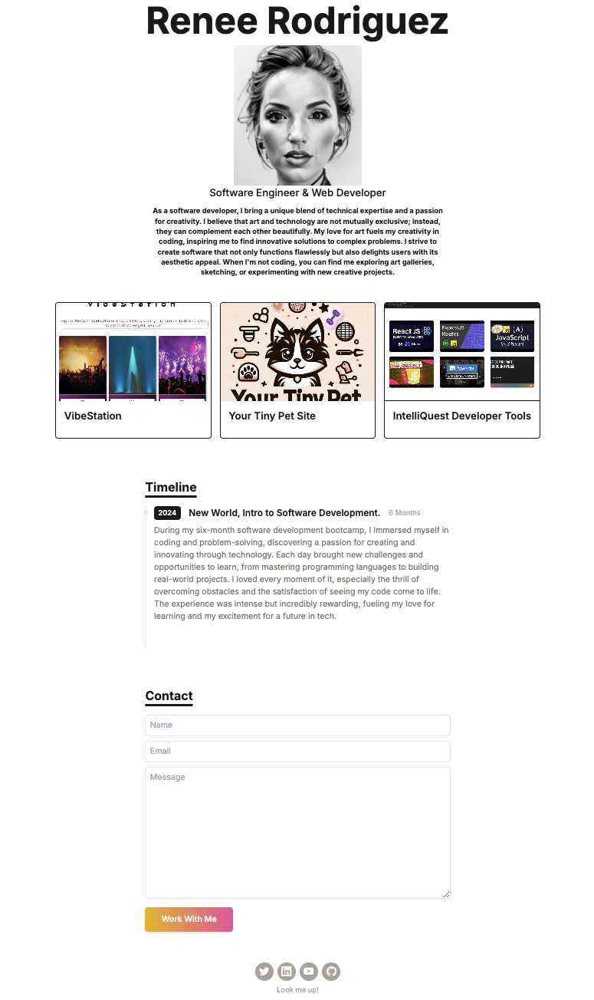

# My-React-Portfolio

  ## Description

I created a portfolio using Vite and React, which made the development process smooth and efficient. Vite's fast build times and hot module replacement enhanced my workflow, allowing me to focus on designing a responsive and dynamic user interface with React. I enjoyed the flexibility React provided in building reusable components, making the portfolio not only visually appealing but also highly functional. 

  

  ## Link to deployed portfolio site:

  https://main--portfoliobyrenee.netlify.app/

   ## Link to Github Repository:

  https://github.com/ReneeRod333/My-React-Portfolio

  ## Screenshot
  

  ## Credits

  ### Tutorial provided by Forest Knight.

  https://www.youtube.com/watch?v=b0pkpcD8Ms4

  ## License
    Licensed under the MIT license.